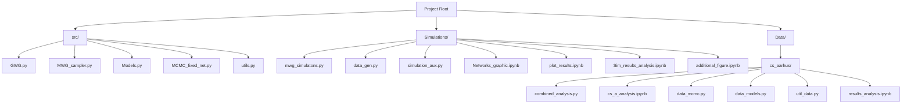

# Estimating Causal Effects Using Proxies of the Interference Network

See preprint at (arXiv link here).

## Code Structure

This diagram provides a high-level overview of the main code and data structure. Notebooks are marked with `.ipynb` extensions.

The code is organized as follows:
- `src`: contains auxiliary scripts used in the numerical illustrations.
- `Simulations/`: contains the code to run the fully-synthetic experiments.
- `Data/cs_aarhus`: contains the code to run the semi-synthetic experiments.

## Software Requirements
The code is written in Python 3.11. Run 'requirements.txt' file to install all required packages. 

## Running the Experiments
- The script `Simulations/mwg_simulations.py` contains the code to run the fully-synthetic experiments.
- The script `Data/cs_aarhus/combined_analysis.py` contains the code to run the semi-synthetic experiments. 

Both scripts were executed in a power-cluster with multiple cores. Running them in a PC with CPU might take a while. Adjust parameters accordingly!

## Additional Files

- The file `src/GWG.py` contain the implementation of the Locally Informed Proposals with gradient approximations.
- The file `src/MWG_sampler.py` contain the implementation of the Block Gibbs algorithm.

## Data Availability
The data used in the semi-synthetic experiments is available at: https://manliodedomenico.com/data.php
